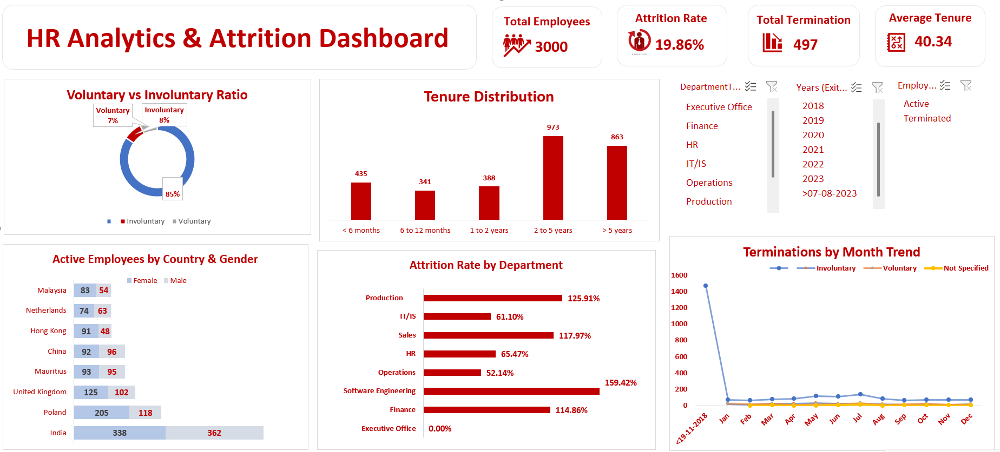

# HR Analytics & Attrition Dashboard

## Project Overview

This project presents an interactive HR Analytics & Attrition Dashboard
developed using Microsoft Excel.

The dashboard provides insights into employee attrition, termination trends,
employee tenure, department-wise performance and workforce demographics.

## Tools & Technologies

- Microsoft Excel
- Pivot Tables
- Pivot Charts
- Slicers
- Data Cleaning
- Data Analysis
- Data Visualization

## Key Performance Indicators

- Total Employees
- Attrition Rate
- Total Terminations
- Average Tenure

## Dashboard Analysis

- Voluntary vs Involuntary Attrition
- Employee Tenure Distribution
- Active Employees by Country & Gender
- Attrition Rate by Department
- Monthly Termination Trends
- Year-wise Termination Analysis
- Employee Status Analysis

## Interactive Filters

- Department
- Years
- Employee Status

## Dashboard Preview

## Project Objective

The objective of this project is to analyze employee attrition patterns
and provide meaningful HR insights through an interactive Excel dashboard.

## Skills Demonstrated

- Data Cleaning
- Data Analysis
- Data Visualization
- Dashboard Development
- Excel Reporting
